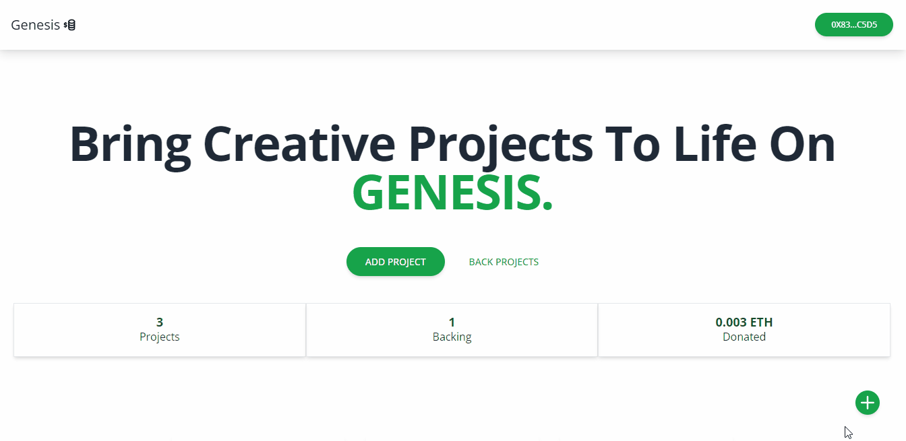
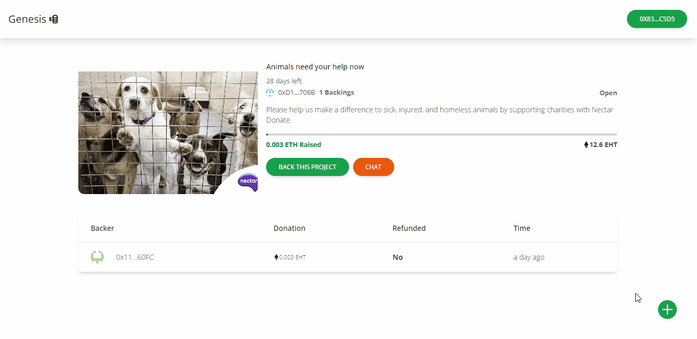

# Web3 Crowd-Funding Platform with React, Solidity , CometChat

 Web3 Crowdfunding solution takes the standard crowdfunding platform features, and adds Securitize’s tokenization-first approach to deliver a Web3-focused investor experience. This solution allows you to easily invite your customers and fans to participate in your offering, compliantly onboard them as investors through KYC and AML protocols, sign all documentation and invest in your fundraise — all from within their digital wallet.







## Technology

This demo uses:

- Metamask
- Hardhat
- Infuria
- ReactJs
- Tailwind CSS
- CometChat
- Solidity
- EthersJs
- Faucet

## Running the demo

To run the demo follow these steps:

1. Clone the project with the code below.
    ```sh

    # Make sure you have the above prerequisites installed already!
    git clone https://github.com/Daltonic/genesis PROJECT_NAME
    cd PROJECT_NAME # Navigate to the new folder.
    yarn install # Installs all the dependencies.
    ```
2. Create an Infuria project, copy and paste your key in the spaces below.
3. Update the `.env` file with the following details.
    ```sh
    ENDPOINT_URL=<RPC_URL>
    SECRET_KEY=<SECRET_PHRASE>
    DEPLOYER_KEY=<YOUR_PRIVATE_KEY>
    ```
2. Create a CometChat project, copy and paste your key in the spaces below.
3. Run the app using `yarn start`
<br/>

## Useful links


- ⚽ [Metamask](https://metamask.io/)
- 🚀 [Remix Editor](https://remix.ethereum.org/)
- 💡 [Hardhat](https://hardhat.org/)
- 📈 [Infuria](https://infura.io/)
- 🔥 [ReactJs](https://reactjs.org/)
- 🐻 [Solidity](https://soliditylang.org/)
- 👀 [EthersJs](https://docs.ethers.io/v5/)
- 🎅 [Faucet](https://faucets.chain.link/rinkeby)


